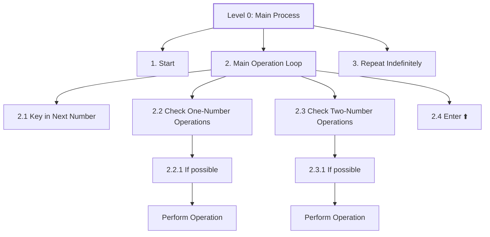

# Arsla

**Stack-based language**

Arsla is a **stack-based code golfing language** developed for implicit operations in a modular approach storing information to stack.
Arsla uses inituitive approach inspired from [Vyxal](https://vyxal.org/) and [05AB1E](https://github.com/Adriandmen/05AB1E) in the development.
Arsla is a postfix notation based language inspired from the concept of Reverse Polish Notation in its implementation.

The language was inspired by Dijkstra's quote
> One morning I was shopping in Amsterdam with my young fiancée, and tired, we sat down on the café terrace to drink a cup of coffee and I was
> just thinking about whether I could do this, and I then designed the algorithm for the shortest path.
---

# Table of Contents
- [Introduction](#Introduction)
  - [RPN methodology](#RPN-methodology)
- [Features](#features)
  - [Stack-Based implementation](#Stack-Based-implementation)

## Introduction
Reverse Polish notation reverses an infix notation to a postfix notation. For example `a + b` is transcribed to `b a +`. This repository implements
such a programming language that is aimed to golf solutions, or store research-based data. We design an interpreter which aims to develop this goal.

### RPN methodology

##  Features

###  Stack-Based implementation
- **Single-character commands**: `+` (add), `!` (factorial), `D` (duplicate)
- **Implicit I/O**: Automatically reads input and outputs the final stack
- **Vectorization**: Apply operations to entire array  
  Example: `[1 2 3]2+` → `[3 4 5]`
  
